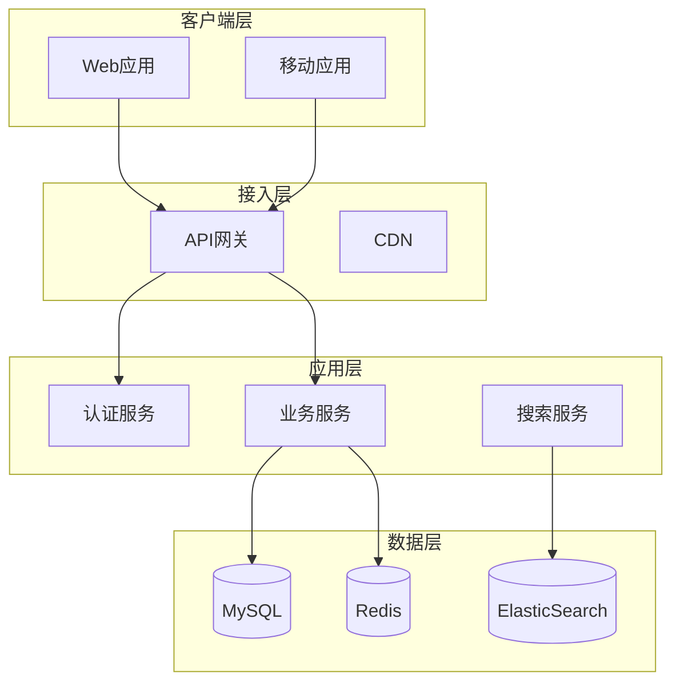
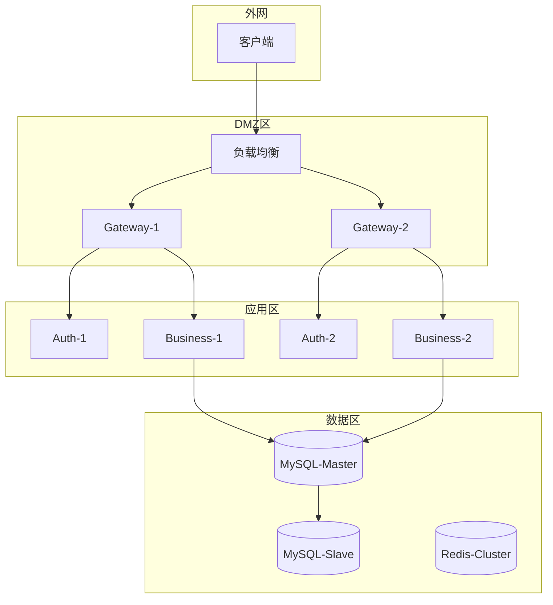

# Architect Planner - 架构规划专家 Skill

## 🎯 核心功能

使用 Gemini CLI 的 **1M 上下文能力**进行大型系统架构设计和规划。

**替代**: PAL MCP clink gemini planner

**核心优势**: Gemini 1M 上下文可以同时分析大量代码和文档。

## 📋 触发场景

**自动触发**:
- "架构设计"
- "系统规划"
- "架构评审"
- "技术架构方案"
- "planner"

**手动触发**:
```
使用 architect-planner 设计：<架构需求>
```

## 🔄 Workflow

### Step 1: 需求收集

收集架构设计需要的信息：
- 业务需求
- 非功能需求 (性能、可用性、扩展性)
- 约束条件 (预算、团队、时间)
- 现有系统情况

### Step 2: Gemini 架构设计 (1M 上下文)

**⚠️ 重要: 优先使用 `gemp` (长任务优化版)，`gemini` CLI 作为备用**

```bash
# Step 1: 写入 prompt 到临时文件
cat > /tmp/gemini_architect_prompt.txt << 'PROMPT_EOF'
作为资深架构师 (20年经验)，设计以下系统架构：

【业务需求】
<业务需求>

【非功能需求】
- 并发: <并发量>
- 可用性: <SLA 要求>
- 数据量: <数据规模>
- 响应时间: <性能要求>

【约束条件】
- 团队规模: <人数>
- 技术栈偏好: <技术栈>
- 预算: <预算范围>
- 时间: <上线时间>

请提供完整的架构设计：

1. **系统架构图**
   - 核心组件
   - 数据流向
   - 技术选型

2. **模块划分**
   - 各模块职责
   - 接口定义
   - 依赖关系

3. **数据架构**
   - 数据模型
   - 存储方案
   - 数据流转

4. **部署架构**
   - 服务拓扑
   - 网络规划
   - 高可用方案

5. **扩展性设计**
   - 水平扩展方案
   - 性能瓶颈预判
   - 容量规划

6. **安全架构**
   - 认证授权
   - 数据加密
   - 安全边界

7. **监控运维**
   - 监控指标
   - 日志收集
   - 告警策略

8. **实施路线**
   - 分阶段计划
   - 关键里程碑
   - 风险评估

使用 Markdown + Mermaid 图表展示。
PROMPT_EOF

# Step 2: 优先使用 gemp (20分钟超时，输出纯净)
cat /tmp/gemini_architect_prompt.txt | node ~/.gemini/long_task_runner.js 2>&1
```

**备用方案** (如果 gemp 失败):
```bash
cat /tmp/gemini_architect_prompt.txt | gemini --yolo 2>&1 | grep -v "STARTUP\|YOLO\|Load"
```

### Step 3: Claude 补充和优化

Claude 基于 Gemini 的设计：
1. 补充具体技术选型建议
2. 提供代码框架示例
3. 指出潜在风险和缓解措施

## 📊 输出格式

```markdown
## 🏛️ 系统架构设计方案

**项目**: [项目名称]
**设计目标**: [核心目标]

---

### 📐 系统架构图



**技术选型理由**:
- API网关: Kong (高性能、插件丰富)
- 缓存: Redis (支持多种数据结构)
- 搜索: ElasticSearch (全文检索)
- 数据库: MySQL (ACID保证)

---

### 🧩 模块划分

#### 1. 认证服务 (Auth Service)

**职责**:
- 用户认证 (JWT)
- 权限管理 (RBAC)
- SSO 集成

**接口**:
```typescript
interface AuthService {
  login(username: string, password: string): Promise<Token>;
  verify(token: string): Promise<User>;
  refresh(refreshToken: string): Promise<Token>;
}
```

**依赖**:
- Redis (token 存储)
- MySQL (用户数据)

---

#### 2. 业务服务 (Business Service)

**职责**:
- 核心业务逻辑
- 数据CRUD
- 事件发布

**接口**:
```typescript
interface BusinessService {
  createOrder(order: Order): Promise<OrderId>;
  updateOrder(id: OrderId, data: Partial<Order>): Promise<void>;
  getOrder(id: OrderId): Promise<Order>;
}
```

**依赖**:
- MySQL (持久化)
- Redis (缓存)
- MQ (事件)

---

### 💾 数据架构

#### 数据模型

```sql
-- 用户表
CREATE TABLE users (
  id BIGINT PRIMARY KEY AUTO_INCREMENT,
  username VARCHAR(50) UNIQUE NOT NULL,
  email VARCHAR(100) UNIQUE NOT NULL,
  created_at TIMESTAMP DEFAULT CURRENT_TIMESTAMP,
  INDEX idx_email (email)
);

-- 订单表 (分表策略: 按用户ID hash)
CREATE TABLE orders (
  id BIGINT PRIMARY KEY,
  user_id BIGINT NOT NULL,
  amount DECIMAL(10,2),
  status ENUM('pending', 'paid', 'cancelled'),
  created_at TIMESTAMP DEFAULT CURRENT_TIMESTAMP,
  INDEX idx_user_id (user_id),
  INDEX idx_created_at (created_at)
);
```

#### 存储方案

| 数据类型 | 存储方案 | 理由 |
|---------|---------|------|
| 用户数据 | MySQL | 强一致性需求 |
| 会话数据 | Redis | 高频读写 |
| 订单数据 | MySQL (分表) | 数据量大，按用户分片 |
| 搜索索引 | ElasticSearch | 全文检索 |
| 日志数据 | ClickHouse | 大数据量分析 |

#### 缓存策略

```typescript
// Cache-Aside 模式
async function getUser(id: string): Promise<User> {
  // 1. 查缓存
  const cached = await redis.get(`user:${id}`);
  if (cached) return JSON.parse(cached);
  
  // 2. 查数据库
  const user = await db.query('SELECT * FROM users WHERE id = ?', [id]);
  
  // 3. 写缓存 (TTL 1小时)
  await redis.setex(`user:${id}`, 3600, JSON.stringify(user));
  
  return user;
}
```

---

### 🚀 部署架构



**高可用方案**:
- API网关: 2个实例 + LVS负载均衡
- 应用服务: 至少2个实例 (跨机房)
- MySQL: 主从复制 + MHA自动切换
- Redis: Cluster模式 (3主3从)

**容灾策略**:
- RTO (恢复时间目标): < 5分钟
- RPO (数据丢失目标): < 1分钟
- 异地备份: 每天全量 + 实时增量

---

### 📈 扩展性设计

#### 水平扩展方案

**应用层**:
- 无状态设计 (session 存 Redis)
- 支持动态扩容 (K8s HPA)
- 目标: 支持 10x 流量增长

**数据层**:
- MySQL: 读写分离 + 分库分表
  - 按用户ID hash 分16个库
  - 每个库按时间分表 (月表)
- Redis: Cluster 水平扩展
- 消息队列: Kafka 分区扩展

#### 性能瓶颈预判

| 场景 | 瓶颈点 | 缓解方案 |
|------|--------|---------|
| 高并发读 | 数据库 | 增加 Redis 缓存 + 读写分离 |
| 高并发写 | 数据库 | 分库分表 + 异步写入 |
| 大查询 | 网络带宽 | 分页 + CDN + 数据压缩 |
| 复杂计算 | CPU | 异步队列 + 结果缓存 |

#### 容量规划

**当前容量** (100万 DAU):
- API网关: 4核8G × 2 = 2万QPS
- 业务服务: 4核8G × 4 = 4万QPS
- MySQL: 16核32G × 1主2从 = 2万QPS
- Redis: 8核16G × 6节点 = 20万QPS

**扩展目标** (1000万 DAU):
- API网关: 扩展到 10 实例
- 业务服务: 扩展到 20 实例
- MySQL: 分库到 16 个库
- Redis: 扩展到 30 节点

---

### 🔒 安全架构

#### 认证授权

```typescript
// JWT Token 结构
interface JWTPayload {
  userId: string;
  role: 'admin' | 'user';
  permissions: string[];
  exp: number; // 过期时间
}

// RBAC 权限检查
async function checkPermission(userId: string, resource: string, action: string): Promise<boolean> {
  const user = await getUser(userId);
  const role = await getRole(user.roleId);
  return role.permissions.includes(`${resource}:${action}`);
}
```

#### 安全边界

```
外网 → [WAF] → LB → [API限流] → Gateway → [JWT验证] → Service → [SQL防注入] → DB
         ↓                          ↓                      ↓
      DDoS防护               Token黑名单              参数化查询
```

#### 数据加密

- **传输加密**: HTTPS/TLS 1.3
- **存储加密**: 敏感字段 AES-256 加密
- **密钥管理**: KMS (Key Management Service)

---

### 📊 监控运维

#### 监控指标

**黄金指标**:
- 延迟 (Latency): p50, p95, p99
- 流量 (Traffic): QPS, 带宽
- 错误 (Errors): 错误率, 5xx比例
- 饱和度 (Saturation): CPU, 内存, 磁盘

**业务指标**:
- 订单转化率
- 支付成功率
- 用户活跃度

#### 日志收集

```
应用日志 → Filebeat → Kafka → Logstash → ElasticSearch → Kibana
                                                           ↓
                                                      告警规则
```

#### 告警策略

| 级别 | 触发条件 | 通知方式 |
|------|---------|---------|
| P0 | 服务不可用 | 电话 + 短信 + IM |
| P1 | 错误率 >1% | IM + 邮件 |
| P2 | 延迟 p99 >1s | IM |
| P3 | 磁盘 >80% | 邮件 |

---

### 🛣️ 实施路线

#### Phase 1: MVP (2个月)

**目标**: 核心功能上线

- [ ] Week 1-2: 基础架构搭建
  - 搭建 K8s 集群
  - 配置 MySQL 主从
  - 部署 Redis Cluster

- [ ] Week 3-4: 核心服务开发
  - 认证服务
  - 业务服务 API
  - 基础前端页面

- [ ] Week 5-6: 测试上线
  - 压测 (目标 5000 QPS)
  - 灰度发布
  - 正式上线

**验收标准**:
- 核心功能可用
- QPS 支持 5000+
- p99 延迟 < 500ms

---

#### Phase 2: 优化 (1个月)

**目标**: 性能和稳定性优化

- [ ] Week 1: 性能优化
  - 增加缓存层
  - SQL 慢查询优化
  - CDN 接入

- [ ] Week 2-3: 高可用
  - 数据库主从切换演练
  - 应用多实例部署
  - 监控告警完善

- [ ] Week 4: 压测验证
  - 压测到 20000 QPS
  - 故障演练
  - 性能报告

**验收标准**:
- QPS 支持 20000+
- 可用性 99.9%
- 主从切换 < 30s

---

#### Phase 3: 扩展 (持续)

**目标**: 支持业务增长

- 分库分表实施
- 微服务拆分
- 多机房部署
- 国际化支持

---

### ⚠️ 风险评估

| 风险 | 影响 | 概率 | 缓解措施 |
|------|------|------|---------|
| MySQL 单点故障 | 高 | 中 | 主从复制 + MHA |
| Redis 数据丢失 | 中 | 低 | AOF持久化 + 定期备份 |
| 第三方服务不可用 | 中 | 中 | 熔断降级 + 本地缓存 |
| 团队技术储备不足 | 高 | 高 | 培训 + 外部顾问 |

---

**📅 设计时间**: [时间戳]
**🤖 架构师**: Gemini (1M 上下文) + Claude (补充)
**📐 架构评分**: [评分] / 10
```

---

### 🎯 Claude 补充建议

[Claude 基于 Gemini 的架构设计，补充具体技术实现建议]

---

**创建时间**: 2025-12-19
**版本**: v1.0
**替代**: PAL MCP clink gemini planner
