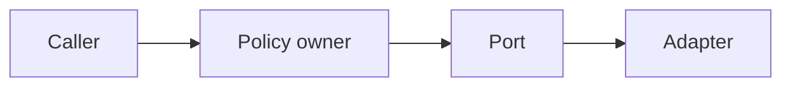

# Architecture Review Report Formats

Use the common finding contract and the template for the selected mode. Keep the report concise enough to drive a decision.

## Common Finding Contract

````markdown
### [AR-001] [BLOCKING|HIGH|MEDIUM|LOW] Short causal title

- Evidence: `path/to/file.ext:line` and the relevant relationship or behavior
- Boundary expectation: responsibility, dependency rule, or quality attribute
- Scenario: concrete change, failure, replacement, scale, or migration event
- Impact: affected modules, contracts, tests, deployments, or owners
- Recommendation: smallest viable correction
- Tradeoff: added complexity, migration cost, compatibility risk, or limitation
- Confidence: high | medium | low, with the reason when not high
````

Use a stable `AR-NNN` identifier so follow-up work can reference a finding. Consolidate evidence locations under one causal finding rather than emitting one finding per file.

## `design` Mode

````markdown
## Architecture Review

- Mode: design
- Scope: [artifacts and affected subsystem]
- Baseline: [current architecture or prior decision]
- Status: CLEAR | WATCH | BLOCK | INCONCLUSIVE

### Decision Summary
[What the proposal changes, why, and the constraints it must satisfy]

### Proposed Architecture
[Responsibilities, interfaces, dependency direction, and data/control flow]



### Scenario Checks
| Scenario | Expected behavior | Architecture support | Gap |
|---|---|---|---|
| Add known variant | ... | ... | ... |
| Dependency failure | ... | ... | ... |
| Migration/rollback | ... | ... | ... |

### Findings
[Common finding contract, ordered by severity]

### Supported Strengths
- [Evidence-backed decision that reduces risk or change cost]

### Assumptions and Unknowns
- [What implementation or production evidence must confirm]

### Verdict
[Status rationale and smallest next decision/action]
````

Omit the diagram when prose or a short table is clearer. Do not invent a current architecture when only a proposal was supplied.

## `change` Mode

````markdown
## Architecture Review

- Mode: change
- Scope: [diff, branch, feature, and affected neighbors]
- Baseline: [base commit/branch or design artifact]
- Status: CLEAR | WATCH | BLOCK | INCONCLUSIVE

### Change Architecture Summary
[New/changed responsibilities, contracts, dependencies, state, and integrations]

### Before / After
| Concern | Before | After | Consequence |
|---|---|---|---|
| Dependency direction | ... | ... | ... |
| Public interface | ... | ... | ... |
| Change path | ... | ... | ... |
| Test boundary | ... | ... | ... |

### Findings
[Common finding contract, ordered by severity]

### Architecture Conformance
- Planned boundaries: [matched / diverged / unavailable]
- Dependency rules: [preserved / changed]
- Extension path: [localized / distributed / not relevant]
- Test boundary: [stable public surface / internal wiring / missing]

### Supported Strengths
- [Evidence-backed improvement or preserved boundary]

### Unknowns
- [Unavailable base, generated code, runtime topology, missing tests, etc.]

### Verdict
[Status rationale and smallest next action before merge or follow-up]
````

Do not repeat general code-review findings unless they reveal a boundary or ownership problem.

## `system` Mode

````markdown
## Architecture Health Review

- Mode: system
- Scope: [repository or subsystem]
- Baseline: [documented target, previous review, or current state only]
- Status: CLEAR | WATCH | BLOCK | INCONCLUSIVE

### Sampling Strategy
[Why these entry points, dependency hubs, change hotspots, and boundaries were inspected]

### Current Architecture
[Responsibilities, major dependencies, processes, data ownership, and deployment boundaries]

### Priority Hotspots
| Priority | Area | Architecture risk | Evidence | Trigger for action |
|---|---|---|---|---|
| 1 | ... | ... | `path:line` | ... |

### Findings
[Only the highest-value common findings; normally no more than 5–10]

### Drift from Intended Architecture
- [Documented rule or ADR] → [observed divergence] → [impact]

### Supported Strengths
- [Boundary or evolution path that is working well]

### Deferred Observations
- [Candidate that lacks evidence, is low impact, or needs a narrower review]

### Verdict and Next Review Trigger
[Status rationale, first corrective action, and milestone/event that should trigger reassessment]
````

Avoid a numeric health score unless the repository already defines and owns a scoring model.

## Reporting Rules

- Lead with the overall status and most consequential finding.
- Order findings by severity, then blast radius and reversibility.
- Cite every negative finding; cite important strengths as well.
- Use diagrams only for relationships that are difficult to explain linearly.
- State “no material findings in the reviewed scope” instead of claiming the architecture is universally correct.
- If evidence is insufficient, use `INCONCLUSIVE` and list the exact missing artifacts or commands needed to resolve it.
