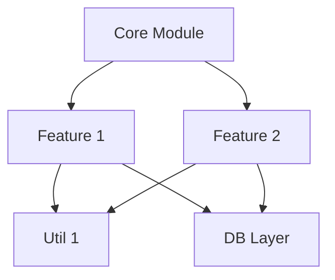

> Codex CLI: Manual invocation only (`$project-analyze`). No hooks or auto-run.

# Project Intelligence Analysis Skill

## When to Use This Skill

Automatically invoke this Skill when:
- User asks "explain this project", "how does this work?"
- User wants to understand architecture or module structure
- User needs impact analysis before refactoring
- User asks about dependencies or file relationships
- User mentions "high-risk files", "critical modules"
- Keywords: "project structure", "architecture", "dependencies", "impact", "understand codebase"

## What This Skill Does

**ProjectMind Intelligence** provides:
1. **Knowledge Graph Analysis** - Deep project structure understanding
2. **Dependency Mapping** - Complete relationship visualization
3. **Risk Assessment** - High-risk file identification
4. **Impact Prediction** - Change impact estimation
5. **Smart Caching** - 40s first run, <1s subsequent queries

ProjectMind is a local static-analysis workflow. Do not call external model
CLIs, legacy long-context wrappers, `hybrid_intelligent_system.py`,
`hybrid_intelligent_system_v2.py`, `hybrid_intelligent_system_v3.py`, or any
external AI advisor as part of this skill. Use the local knowledge graph output
plus direct repository inspection by Codex.

## Instructions

When this Skill is invoked:

### Step 1: Extract the Query and Project Path

Identify:
- **User's Question**: What they want to know
- **Project Path**: Usually current directory `$(pwd)` or user-specified path

### Step 2: Execute the Local ProjectMind Scan

**IMPORTANT**: You MUST execute the local ProjectMind knowledge graph scanner:

```bash
python /Users/WangQiao/claude-enhanced-quality/project_mind.py [project_path]
```

If project path is not specified, use current directory:
```bash
python /Users/WangQiao/claude-enhanced-quality/project_mind.py $(pwd)
```

Use the scanner output as structured evidence. For query-specific details that
the summary does not contain, inspect the repository directly with `rg`,
`rg --files`, `find`, `sed`, and targeted file reads.

Do not use the legacy hybrid intelligent system entrypoints. They delegate to
external model tooling and are outside this skill's current execution model.

### Step 3: Present Results

Format the output as:

```markdown
## 🧠 Project Intelligence Analysis

**Query**: [User's Question]
**Project**: [Project Path]
**Analysis Time**: [Cached/40s] ⚡

### 📊 Project Overview

- **Total Files**: XXX
- **Lines of Code**: XXX,XXX
- **Main Technologies**: [React, TypeScript, Node.js, etc.]
- **Architecture Pattern**: [MVC, Microservices, Monolith, etc.]

### 🎯 Answer to Your Question

[Direct answer to the user's specific question based on ProjectMind output and targeted local code inspection]

### 🏗️ Architecture Insights

**Module Structure**:
```
Core Modules:
├── [Module 1] (XX files, core business logic)
├── [Module 2] (XX files, data layer)
└── [Module 3] (XX files, API layer)

Supporting Modules:
├── [Utils] (XX files)
└── [Components] (XX files)
```

**Key Relationships**:
- [Module A] depends heavily on [Module B]
- [File X] is central hub (XX dependencies)
- [Component Y] is isolated (low coupling)

### ⚠️ High-Risk Areas

| File/Module | Risk Level | Reason | Dependencies |
|-------------|------------|--------|--------------|
| [Path 1] | 🔴 Critical | Core auth logic, 45 dependencies | 45 files |
| [Path 2] | 🟠 High | Payment processing | 32 files |
| [Path 3] | 🟡 Medium | Complex business rules | 18 files |

### 💡 Recommendations

**If Planning Changes**:
1. **[Specific Module]**
   - Files Affected: XX files
   - Risk Level: [Low/Medium/High]
   - Test Requirements: [Unit/Integration/E2E]
   - Estimated Effort: X hours

2. **[Another Module]**
   - Impact: [Detailed impact analysis]
   - Mitigation: [How to reduce risk]

**Architecture Improvements**:
- [Specific decoupling opportunity]
- [Specific pattern improvement]
- [Specific technical debt reduction]

### 🔍 Dependency Visualization



(Note: Mermaid diagram representing key dependencies)

### 🚨 Change Impact Assessment

**Before modifying [specific file/module]**:
- ✅ Test these files: [List]
- ⚠️ Watch for side effects in: [List]
- 🔍 Review integration points: [List]
- ⏱️ Estimated impact: [Low/Medium/High]

### 📈 Technical Metrics

- **Modularity Score**: XX/100
- **Coupling Level**: [Low/Medium/High]
- **Code Churn**: [Files frequently changed]
- **Critical Path**: [Most important business logic files]
```

### Step 4: Provide Actionable Guidance

Offer specific next steps:
- Code locations to examine
- Tests to run before changes
- Files to backup before refactoring
- Team members to consult (if AI annotations present)

## Examples

### Example 1: Understanding Architecture
**User**: "Explain how the authentication system works"

**You execute**:
```bash
python /Users/WangQiao/claude-enhanced-quality/project_mind.py $(pwd)
```

**You present**: Architecture explanation with module relationships, file paths, and authentication flow diagram, using ProjectMind output plus targeted `rg` searches for authentication entry points.

### Example 2: Refactoring Impact
**User**: "I want to refactor the database layer, what's the impact?"

**You execute**:
```bash
python /Users/WangQiao/claude-enhanced-quality/project_mind.py $(pwd)
```

**You present**: Impact analysis showing affected files, risk assessment, and refactoring strategy, verified with local dependency/file searches.

### Example 3: Finding High-Risk Code
**User**: "What are the most critical files in this project?"

**You execute**:
```bash
python /Users/WangQiao/claude-enhanced-quality/project_mind.py $(pwd)
```

**You present**: List of high-risk files with dependency counts, complexity scores, and business criticality.

## Performance Characteristics

- **First Analysis**: ~40 seconds (deep project scan)
- **Cached Queries**: <1 second (instant response)
- **File Limit**: 300 files deep analysis
- **Cache Invalidation**: Automatic on file changes

## Smart Caching System

The system automatically caches:
- ✅ Project structure analysis
- ✅ Dependency mappings
- ✅ Code entity relationships
- ✅ Risk assessments

Cache updates when:
- Files are modified
- Dependencies change
- Project structure updates

## Integration with Other Systems

### Git Memory Integration
- Tracks commit intentions automatically
- Analyzes team collaboration patterns
- Detects potentially conflicting changes

### CodeDNA Integration
- Project-level quality scoring
- Hotspot identification with quality metrics
- ROI-optimized refactoring prioritization

### AI-Specific Annotations

Recognizes and utilizes:
```typescript
/*@ai:risk=1-5|deps=file1,file2|core=true|chain=auth*/
```

Annotation fields:
- `risk`: 1 (safe) to 5 (critical)
- `deps`: Key dependencies
- `core`: Core functionality flag
- `chain`: Business logic chain identifier
- `api`: API type (internal/external)
- `auth`: Authentication requirements

## Important Notes

- **Always execute** the Python command, don't simulate analysis
- **Never use external model CLIs** or the legacy hybrid AI analysis scripts for this skill
- **Use current directory** as default project path
- **Explain relationships**, not just list files
- **Provide visual diagrams** when helpful
- **Assess real impact**, not theoretical concerns
- **Offer specific actions**, not generic advice

## Common Analysis Queries

### Architecture Understanding
- "How does [feature] work?"
- "What's the data flow for [process]?"
- "Explain the module structure"

### Impact Analysis
- "Impact of changing [file/module]?"
- "What depends on [component]?"
- "Risk of refactoring [area]?"

### Code Navigation
- "Where is [functionality] implemented?"
- "Which files handle [feature]?"
- "What are the entry points?"

### Quality Assessment
- "What are the problem areas?"
- "Where should we focus refactoring?"
- "What's the technical debt?"

## Prerequisites

- Python environment
- ProjectMind V2 system installed
- Read access to project files
- Write access for caching (automatic)

## Fallback Strategy

**DO NOT use legacy hybrid scripts** (`hybrid_intelligent_system.py`,
`hybrid_intelligent_system_v2.py`, or `hybrid_intelligent_system_v3.py`) - they
delegate to external model tooling and are deprecated for this skill.

If the local ProjectMind scan fails:
1. Check project path is correct
2. Verify Python environment
3. Examine error message
4. Fall back to direct local inspection with `rg`, `rg --files`, and targeted file reads
5. Report the issue and mark which parts are based on fallback inspection

## Performance Tips

- First query takes 40s to build knowledge graph
- Subsequent queries are instant (cached)
- Narrow queries get faster responses
- Broader queries provide more context
