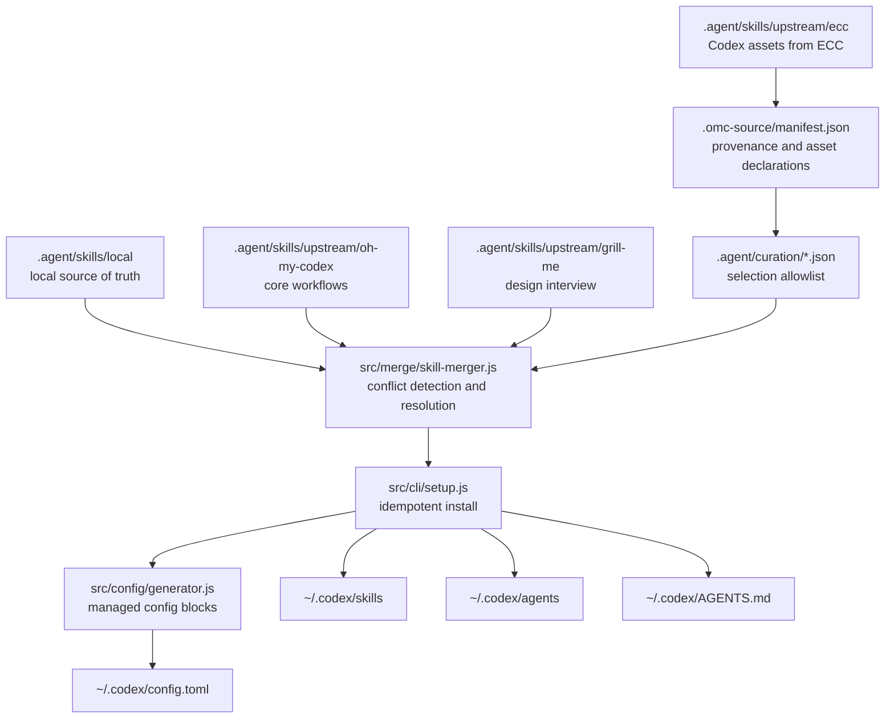

# 我为什么继续做自己的 oh-my-codex

> 内部技术分享稿  
> 主题：从本地配置管理工具，到多源技能生态治理工具

## 分享摘要

`oh-my-codex` 最早只是我在 1 月份写的一个本地 Codex 配置管理小工具。它的目标很简单：把我使用 OpenAI Codex CLI 时分散在各处的配置、skills、prompts、rules 收拢起来。

后来 GitHub 上出现了一个新的、同名的、看起来更成熟的开源项目。那时我认真考虑过要不要放弃自己的项目，直接 fork 或迁移过去。这个判断并不轻松，因为对方确实更完整，而我自己的项目还很早期。

最后我没有简单放弃，也没有选择硬拼功能数量。`oh-my-codex` 的方向逐渐从“我自己的配置管理器”，转成了一个“能吸收上游能力，同时保留本地演进权”的 Codex 工作台。

现在这个项目的 NPM 包名是 `oh-my-codex-cli`，版本是 `1.1.7`。它面向 OpenAI Codex CLI，定位为 skill pack 和 workflow orchestration 工具。README 中的描述是：

> Enterprise-grade Codex skill ecosystem with multi-source upstream management.

这个描述有点重，但背后的工程方向很实际：不要把所有能力都当成自己原创，而是治理多个来源的 skills、agents、MCP servers、rules 和 Codex 配置。

## 1. 最早的问题：Codex 配置太散

我 1 月份开始写 `oh-my-codex` 时，它不是一个生态项目。

当时最直接的问题是：Codex 用得越多，本地工作流越散。

- skills 在一个目录里；
- prompts 在另一个目录里；
- AGENTS.md 和规则文件经常要复制；
- MCP 配置需要手动维护；
- 一些常用工作流只能靠记忆触发。

这些问题不算复杂，但会持续消耗注意力。尤其是当我希望 Codex 按固定方式执行任务时，配置、提示词、规则、技能之间没有一个稳定的管理入口，就会导致每个项目都要重新整理一遍。

所以最初的 `oh-my-codex` 很朴素：把我自己用 Codex CLI 时需要的配置管理起来。

它更像一个个人工具，而不是一个开源产品。

## 2. 同名项目出现后的尴尬

后来 GitHub 上出现了一个新的、同名的、看起来更成熟的开源项目。

我当时的第一反应不是兴奋，而是有一点尴尬。

名字撞了，方向也撞了，而且对方看起来更完整。作为一个已经写了一段时间的人，这种感觉很现实：你会突然怀疑自己是不是在重复造一个更差的轮子。

当时摆在我面前有两个选择：

1. 放弃自己的项目，直接 fork 或迁移到那个更成熟的开源项目；
2. 继续迭代自己的项目，但必须回答一个问题：它怎么才能不被更大的开源项目淘汰？

如果只是继续堆功能，这个问题没有好答案。

更大的上游项目可以有更多 skills、更完整的 agents、更成熟的文档、更好的默认配置。我没有必要和它正面对抗。那样做的结果大概率是：我维护一个永远落后一点的集合包。

这个判断其实过了一段时间才成立。刚开始我还是会下意识比较：对方有多少技能，我有多少技能；对方有哪些工作流，我是不是也要补齐。后来才意识到，这不是一个应该靠数量解决的问题。

## 3. 真正的问题变了

后来我换了一个问题。

原来的问题是：

> 我的项目能不能比上游更强？

后来变成：

> 我的项目能不能吸收更强的上游，同时保留我自己的工作方式？

这两个问题完全不一样。

如果目标是“比上游强”，那我需要和所有上游项目拼功能数量。这个方向会把项目做成一个越来越大的技能集合。

但如果目标是“吸收上游能力”，项目的价值就变成了治理层：

- 哪些能力来自本地？
- 哪些能力来自上游？
- 哪些上游能力应该进入运行时？
- 同名 skill 冲突时谁优先？
- 上游更新时能不能保护本地修改？
- setup 重复执行时会不会污染配置？
- Claude Code 生态里的能力，哪些能适配到 Codex，哪些不能？

这个方向让我找到了继续做 `oh-my-codex` 的理由。

它不需要成为所有能力的原创来源。它需要成为一个 local-first 的工作台。

## 4. 当前项目定位

现在仓库里的 `oh-my-codex` 已经不是单纯的配置复制脚本。

项目当前事实：

- 项目名：`oh-my-codex`
- NPM 包名：`oh-my-codex-cli`
- 当前版本：`1.1.7`
- 面向对象：OpenAI Codex CLI
- 项目定位：skill pack 和 workflow orchestration
- README 定位：multi-source upstream management
- 当前能力规模：130+ merged skills、3 Codex agents、11 managed MCP server entries

这里的 skill 数按当前本地 `omcodex setup --dry-run` 的合并结果计算：4 个来源筛选后共有 140 个候选 skills，处理 9 个同名冲突后，最终会安装 131 个唯一 skills。

更关键的是它的来源结构。

目前项目把能力来源分成几类：

- `Local`：本地自定义技能，是自己的 source of truth；
- `oh-my-codex`：核心执行模式和工作流；
- `grill-me`：需求/设计拷问式访谈；
- `everything-claude-code / ECC`：跨语言规则、MCP 配置和专业 agents。

这意味着项目的核心不再是“我写了多少 skill”，而是“我如何治理这些来源”。

## 5. 架构转向：从工具到治理层

当前架构里最重要的分层是：

```text
.agent/
├── skills/
│   ├── local/
│   └── upstream/
│       ├── oh-my-codex/
│       ├── grill-me/
│       └── ecc/
├── curation/
└── sources.json
```

### 5.1 `.agent/skills/local/`：本地 source of truth

`.agent/skills/local/` 是本地技能目录。

它代表这个项目自己的工作方式。我的自定义 workflow、长期沉淀的技能、对 Codex 的使用习惯，都应该以这里为准。

这也是 local-first 的基础：上游可以很强，但不应该默认覆盖本地工作流。

### 5.2 `.agent/skills/upstream/`：上游能力输入

`.agent/skills/upstream/` 放同步来的上游能力。

这里的上游不是运行时最终结果，而是待治理的输入。它们需要经过筛选、冲突处理、配置合并，才会进入 `~/.codex/skills/`、`~/.codex/agents/`、`~/.codex/config.toml` 等运行时位置。

这点很重要。

如果上游目录一同步就直接变成运行时，项目本质上还是被上游牵着走。现在的设计是：上游进入仓库，但不等于自动获得最终解释权。

## 6. Selection-based curation：不是全盘复制

ECC 是一个很好的例子。

仓库里有 `.agent/curation/ecc-codex-selection.json`，用来选择哪些 ECC 资产进入 Codex 运行时。

它不是把 ECC 的所有内容都安装进去，而是通过 allowlist 选择：

```json
{
  "skills": [
    "agent-introspection-debugging",
    "agent-sort",
    "api-design",
    "article-writing",
    "backend-patterns",
    "security-review",
    "verification-loop"
  ],
  "agents": [
    "explorer",
    "reviewer",
    "docs-researcher"
  ],
  "mcpServers": [
    "github",
    "context7",
    "exa",
    "memory",
    "playwright",
    "sequential-thinking"
  ]
}
```

完整上游可以保留在仓库里，方便阅读、对比和后续升级。但真正进入运行时的是被选择过的部分。

这解决了一个实际问题：我不想在“全盘接受上游”和“完全拒绝上游”之间二选一。

上游项目越强，内容越多，越需要 curation。否则能力不是变多，而是变乱。

## 7. Manifest-driven：记录来源和资产边界

另一个关键设计是 `.omc-source/manifest.json`。

以 ECC 为例，manifest 记录了：

- sourceName；
- remote；
- ref；
- license；
- syncedAt；
- skillsPath；
- selectionFile；
- Codex assets，包括 agentsDir、configToml、agentsSupplement。

这个文件的价值不是“多一份元数据”，而是让 vendored upstream 有身份。

没有 manifest 的上游目录很容易变成一团历史包袱。几周后再看，很难判断：

- 它从哪里同步来？
- 同步到哪个时间点？
- 哪些文件是上游资产？
- 哪些资产应该安装？
- 哪些只是保留作参考？

manifest 把这些信息固定下来，也让后续的 setup 和 sync 能够基于声明工作，而不是靠目录约定猜。

## 8. Conflict resolution：多源同名技能需要治理

多源系统里最麻烦的问题之一是冲突。

比如本地有一个 `security-review`，上游也有一个 `security-review`。这时不能简单地让后复制的覆盖先复制的。

`src/merge/skill-merger.js` 里做了几类冲突检测：

- exact name conflict：同名 skill；
- similar description warning：描述高度相似；
- same intent：不同来源表达同一个意图。

冲突解决不是靠一次性手工判断，而是有策略：

1. 用户配置 preference 优先；
2. 本地 fork 优先；
3. SemVer 更高者优先；
4. 必要时 namespace 保留多个版本。

这里最关键的是第二点：local-first。

代码里明确写了这个原则：本地 authoring source 不应该被上游 SemVer 默认覆盖。即使上游版本号更高，也不意味着它更适合我的工作流。

这个规则看起来保守，但对这个项目很重要。

`oh-my-codex` 如果要成为个人或团队的 AI 工程工作台，就必须允许本地经验长期演进。上游可以贡献能力，但不能无声接管。

## 9. Local-edit protection：同步不能偷偷覆盖本地修改

`scripts/sync-ecc.sh` 负责同步 ECC。

它做了几个很具体的工程选择：

- 通过 sparse checkout 只取 Codex 相关内容；
- 保留 `.codex/` 和 `.agents/skills/`；
- 保留 README 和 LICENSE；
- 同步后更新 manifest 的 `syncedAt`；
- 默认拒绝覆盖本地修改。

local-edit protection 的实现方式很直接：脚本会读取 manifest 里的 `syncedAt`，检查目标目录里是否有晚于这个时间的文件修改。如果有，就拒绝同步，除非显式传 `--force`。

这个机制不是为了复杂，而是为了防止一种很危险的情况：

> 我在上游目录里做了临时修正，下一次同步时被脚本无声覆盖。

一旦这种事发生几次，人就不会再信任同步脚本。最后大家会回到手动复制，项目也会失去治理能力。

## 10. Idempotent install：setup 可以反复执行

安装入口 `scripts/install-codex.sh` 现在更像一个兼容层，最终会调用：

```bash
node ./bin/omcodex.js setup
```

真正的 setup 逻辑在 `src/cli/setup.js`。

它分阶段执行：

1. 安装 merged skills；
2. 安装 prompts；
3. 安装 rules；
4. 安装 global `AGENTS.md`；
5. 合并 `config.toml`；
6. 安装上游 Codex assets；
7. 做 catalog check。

这里的关键不是“安装了很多东西”，而是重复执行不会制造重复配置。

`src/config/generator.js` 使用 managed block 管理配置。每次 setup 会先移除旧的 managed block，再重新生成。上游 MCP 和 agents 也会以单独的 managed block 注入。

这解决了一个常见问题：配置生成脚本第一次跑没问题，第二次跑就开始重复追加，第三次跑以后 `config.toml` 变成垃圾场。

对于一个本地工作台来说，setup 必须可以反复执行。否则它就不是工作流，而是一次性安装脚本。

## 11. Codex-native：不是简单移植 Claude Code 生态

`oh-my-codex` 也不是把 Claude Code 生态改名搬过来。

仓库里的 `docs/ALIGNMENT.md` 和 `docs/CODEX.md` 明确记录了 Codex 和 Claude Code 的能力边界。

Codex 不支持一些 Claude Code 特有能力：

- Claude Code marketplace plugin install；
- PreToolUse / PostToolUse 式执行拦截；
- HUD statusline；
- Claude Code-specific CLI commands；
- Claude Code plugin cache locations。

Codex 支持的是另一套机制：

- skills；
- `AGENTS.md`；
- `.codex/config.toml`；
- MCP servers；
- `.codex/agents/*.toml`；
- notify 事件扩展；
- plan mode；
- Codex-native multi-agent 配置。

所以这个项目不能简单做“移植”。它需要把上游能力拆成可适配的部分，再按 Codex 的运行时重新组织。

这也是我继续做自己项目的另一个原因：我需要的是 Codex-native 的适配层，不是 Claude Code 生态的镜像。

## 12. 为什么不是简单 fork

fork 更成熟的项目当然是一个合理选择。

但对这个场景来说，fork 隐含了一个前提：上游是主线，我的修改是补丁。

这不符合我对 `oh-my-codex` 的需求。

我需要保留的不是几处代码改动，而是一整套工作方式：

- 本地 skills 是 source of truth；
- 上游只是输入之一；
- setup 要保护已有配置；
- Codex 和 Claude Code 的能力边界要被显式表达；
- 多源冲突要有治理；
- 运行时安装要可重复、可恢复、可解释。

如果直接 fork，更容易陷入“跟随上游结构”的惯性。

而我真正想要的是：上游越强，我越能吸收；但吸收之后，最终解释权仍然在本地工作台。

## 13. 为什么不是简单复制上游

简单复制的问题更明显。

短期看，复制最快。把上游目录拉下来，拷到自己的项目里，马上就能获得一堆能力。

但几次更新以后问题就会出现：

- 不知道哪些文件是上游原样；
- 不知道哪些文件被本地改过；
- 不知道下次更新应该覆盖哪些；
- 不知道同名 skill 应该选谁；
- 不知道哪些上游能力其实不适合 Codex；
- 不知道运行时安装的东西是否可重复生成。

所以简单复制不是治理，它只是延迟混乱。

`oh-my-codex` 现在的设计，是把“复制”变成“同步、声明、筛选、合并、安装”。

这个链路比直接复制慢一点，但它可维护。

## 14. 当前架构图



## 15. 这次转向带来的判断

这次项目演进里，我最大的变化不是写了更多代码，而是接受了一件事：

> 自己的项目不一定要比所有上游都强，才有继续存在的价值。

如果一个项目能稳定吸收更好的上游，同时保留自己的演进权，它就有独立价值。

对 `oh-my-codex` 来说，这个价值体现在几个方面：

- 上游能力可以进入，但必须带 provenance；
- 上游内容可以很多，但进入运行时要经过 curation；
- 多源 skill 可以重名，但冲突要显式治理；
- setup 可以反复执行，而不是一次性脚本；
- 本地 workflow 可以长期演进，而不是被上游更新覆盖；
- Codex-native 边界必须被明确表达，而不是照搬 Claude Code。

这也是我后来没有放弃自己项目的原因。

一开始它只是一个配置管理器。现在它更像一个个人 AI 工程工作台。

它的价值不是证明我能重复造出一个更大的轮子，而是让我持续吸收更好的轮子，同时保留自己开车的方式。

## 16. 内部分享可讨论问题

如果把这个项目经验放到团队内部来看，我觉得可以讨论几个问题：

1. 当公司内部工具遇到更成熟的开源项目时，什么时候应该 fork，什么时候应该做适配层？
2. 对 AI 工程工具来说，本地经验和上游能力之间应该如何划边界？
3. 多源 prompt / skill / rule 系统中，冲突应该靠人工约定，还是靠工具显式治理？
4. 内部平台在吸收开源能力时，是否应该强制记录 provenance？
5. setup、sync、config generation 这类工具，怎样设计才算真正可重复执行？

## 附：相关代码入口

- `README.md`：项目定位和多源能力说明；
- `package.json`：NPM 包名、版本和 CLI scripts；
- `.agent/skills/local/`：本地 skills source of truth；
- `.agent/skills/upstream/`：多源 upstream skills；
- `.agent/curation/ecc-codex-selection.json`：ECC allowlist；
- `.agent/skills/upstream/ecc/.omc-source/manifest.json`：ECC provenance 和 Codex assets 声明；
- `scripts/sync-ecc.sh`：ECC sparse checkout 同步和 local-edit protection；
- `scripts/install-codex.sh`：兼容安装入口；
- `src/merge/skill-merger.js`：多源 skill 合并和冲突治理；
- `src/cli/setup.js`：安装流程；
- `src/config/generator.js`：`config.toml` managed block 合并；
- `src/router/skill-router.js`：skill 路由。
